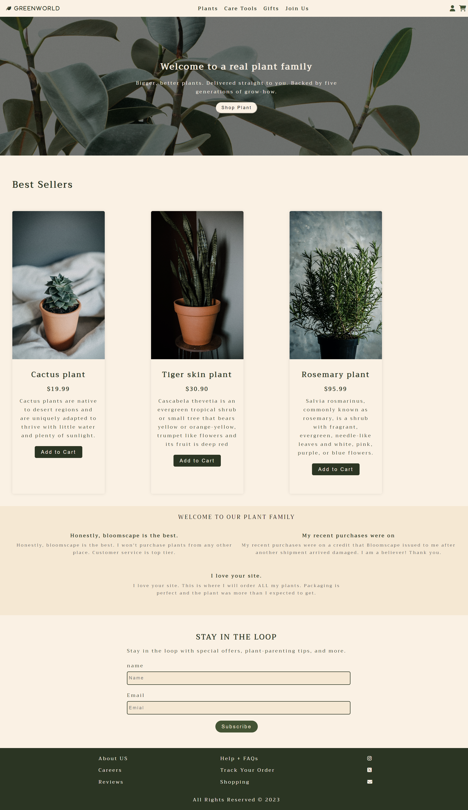

# E-commerce Landing Page

This project is an eCommerce landing page built using HTML, CSS, and Sass. It provides a visually appealing and responsive interface for showcasing products and encouraging user engagement.
## Built With

    

## Demo

## Features

- Responsive design that adapts to different screen sizes and devices.
- Intuitive and user-friendly layout for easy navigation.
- Interactive elements such as product sliders, image galleries, and call-to-action buttons.
- Integration with a back-end system for handling user authentication and product inventory (if applicable).
- Utilizes Sass for enhanced CSS functionality, including variables, mixins, and nested styles.

## Installation
`git clone  https://github.com/1n0ne/E-commerce-LandingPage.git`

## License
MIT
